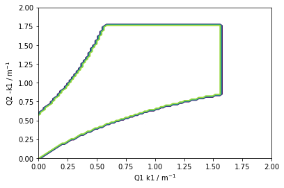

.. _gallery_examples_necktie_plot.ipynb:

Create a necktie plot
=====================

This example notebook demonstrates as a basic example how
sphinx-nbexamples works.

.. code:: ipython3

    import numpy as np
    import matplotlib as mpl
    import matplotlib.pyplot as plt
    import apace as ap
    
    D1 = ap.Drift("D1", length=0.55)
    d1 = ap.Drift("D1", length=0.55)
    b1 = ap.Drift("B1", length=1.5)
    b1 = ap.Dipole("B1", length=1.5, angle=0.392701, e1=0.1963505, e2=0.1963505)
    q1 = ap.Quadrupole("Q1", length=0.2, k1=1.2)
    q2 = ap.Quadrupole("Q2", length=0.4, k1=-1.2)
    fodo_cell = ap.Lattice("FODO_CELL", [q1, d1, b1, d1, q2, d1, b1, d1, q1])
    fodo_ring = ap.Lattice("FODO_RING", [fodo_cell] * 8)

.. code:: ipython3

    n_steps = 100
    k1_start = 0
    k1_end = 2
    
    q1_values = np.linspace(k1_start, k1_end, n_steps)
    q2_values = np.linspace(k1_start, -k1_end, n_steps)
    stable = np.empty((n_steps, n_steps), dtype=bool)
    
    twiss = ap.Twiss(fodo_ring)
    
    for i, q1.k1 in enumerate(q1_values):
        for j, q2.k1  in enumerate(q2_values):
            stable[i, j] = twiss.stable

.. code:: ipython3

    x, y = np.meshgrid(q1_values, -q2_values)
    CS = plt.contour(x, y, stable)
    plt.xlabel(f'{q1.name} k1 / m$^{{-1}}$')
    plt.ylabel(f'{q2.name} -k1 / m$^{{-1}}$')
    plt.show()

.. code:: ipython3

    # TODO change Bend to Drift -> changes necktieplot to center

.. only:: html

    .. container:: sphx-glr-download

        **Download python script:** :download:`necktie_plot.py`

        **Download Jupyter notebook:** :download:`necktie_plot.ipynb`

        **View the notebook in the** `Jupyter nbviewer <https://nbviewer.jupyter.org/github/andreasfelix/apace-examples/blob/master/necktie_plot.ipynb>`__
